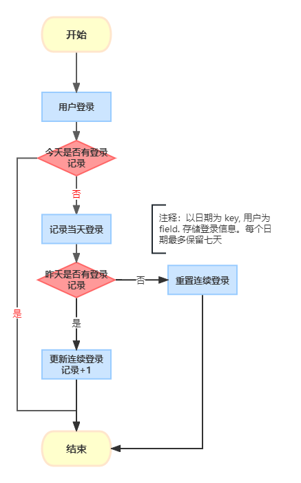

[## question](https://www.jianshu.com/p/a471c47ee2cf)


## 1 画出代码逻辑流程图




## 找出代码逻辑缺陷和代码缺陷

- 28~57 行: 每次进入方法都会触发其中一个分支。当天第一次触发的是 <code> else </code> 分支。创建新记录。后面每次都会进入 <code>if</code> 分支，触发相同的登录处理逻辑。
- 30 行：判断没有 else 闭合分支。异常情况下 <code>countDto</code> 为 null 情况没有处理。
- 每个用户都要至多存储7天登录记录，只为了是否确定老用户。成本较高。


## 设计一个更优方案当前存在的问题和预计后期维护成本

一个用户只需要存储两个时间相关数据
- 上一次登录时间：记录连续登录的开始时间
- 最新一次登录时间：记录连续登录的结束时间


```java
public class Login {

    // mock redis cli
    private final RedisCli redisCli;

    public Login(RedisCli redisCli) {
        this.redisCli = redisCli;
    }

    // 参数简化只用 uid
    public void login(Long uid) throws ParseException {

        // 初始化通用变量
        Date today = new Date();
        SimpleDateFormat format = new SimpleDateFormat("yyyy-MM-dd");

        // latestLoginKey 为最近登录的时间记录 key
        String latestLoginKey = "latestLoginKey" + uid;
        Date latestLoginDate = getDateFromCache(latestLoginKey);

        // 最近一次登录已经是今天
        if (sameDay(latestLoginDate, today)) {
            return;
        }

        // oldestLoginKey 为最早登录的时间记录 key
        String oldestLoginKey = "oldestLoginKey" + uid;
        // 第一次登录
        if (Objects.isNull(latestLoginDate)) {
            redisCli.set(latestLoginKey, format.format(today));
            redisCli.set(oldestLoginKey, format.format(today));
            return;
        }

        //检测是否连续登录
        if (sameDay(addDay(latestLoginDate, 1), today)) {
            // 连续登录，则更新最新的登录日期
            redisCli.set(latestLoginKey, format.format(today));
        } else {
            //非连续登录，重置两个记录值
            redisCli.set(oldestLoginKey, format.format(latestLoginDate));
            redisCli.set(latestLoginKey, format.format(today));
        }

    }

    private Date getDateFromCache(String key) throws ParseException {
        return new SimpleDateFormat("yyyy-MM-dd").parse(redisCli.get(key));
    }

}

```


- 固定两个记录值，存储成本低
- 登录记录可以额外以天进行落库, 职责独立
- 计算连续登录天数，只需要在最新登录日期为今天时，diff 两个日期的时间差
- 是否七天旧用户可以根据 latestLoginKey 记录的时间来进行比较判断，不需要进行多次落库存储